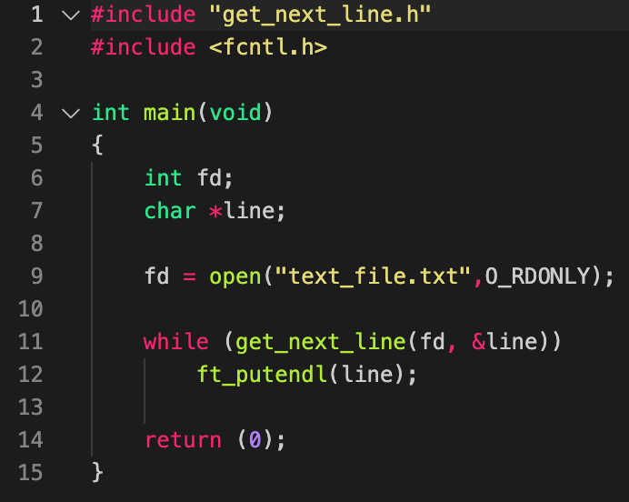

# get_next_line
This is a 1337 school project, all functions except malloc/free/read/write are prohibited by the school and flagged as a cheat, this project is about creating a function to read line by line from a given fd.

## function prototype
<spam style = 'background-color:black'>
	<spam style='color:green'> int </spam>
	<spam style='color:darkgreen'> 
		get_next_line(<spam style='color:darkred'> const int </spam> <spam style='color:gray'> fd </spam>, <spam style='color:darkred'> char </spam> <spam style='color:gray'> **line </spam>) 
	</spam>
</spam>

## usage examle

>this code for usage example

>

>this video demonstrate how the example works

